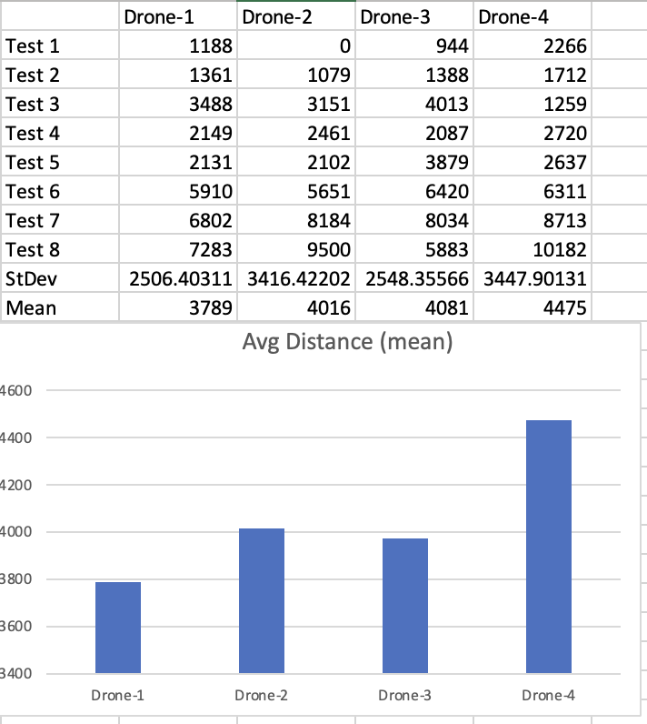

# Analysis of Simulation

There were some fairly simple extrapolations made from the simulation. I tested it 8 times with four tests being on a smaller scale with five trips and four being at a larger scale with ten trips. My goal was to randomly place the trips around the map to see if any trends showed up. From this it essentially becomes a normal distribution and averages out.

 

 

As can be seen above, charging station visits and # of deliveries are all within a standard deviation. This standard deviation calculated to 1.

 

This is the total summation of distance traveled for all the tests. 
