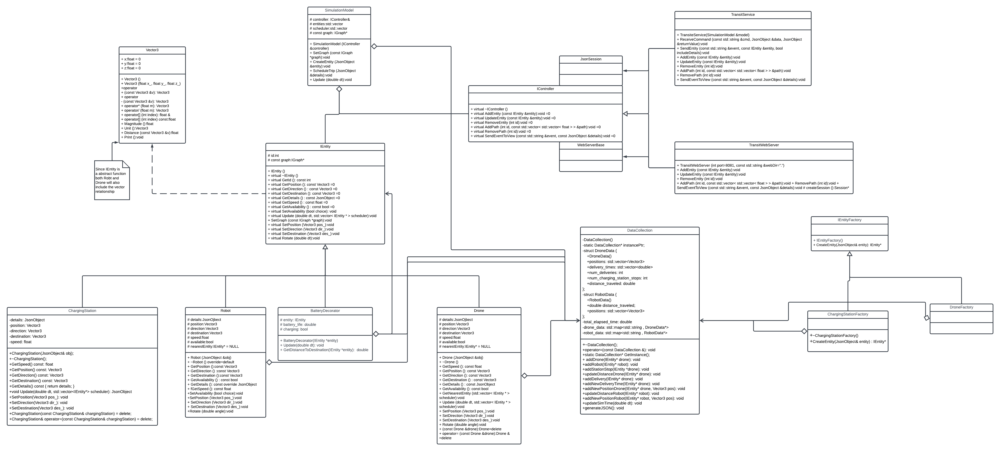
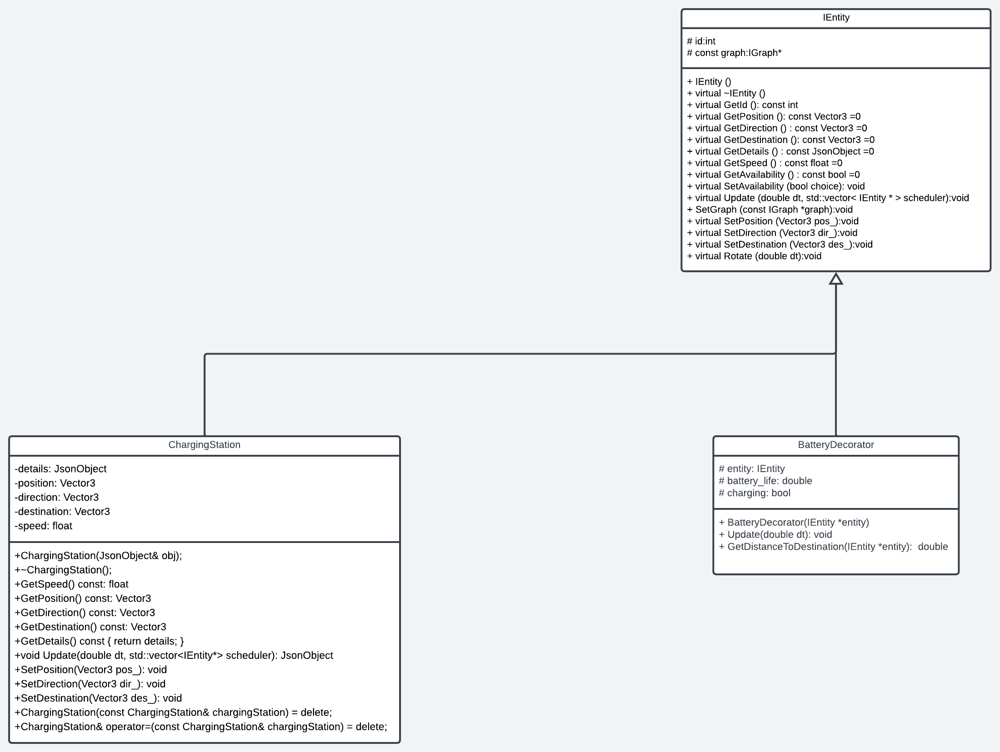
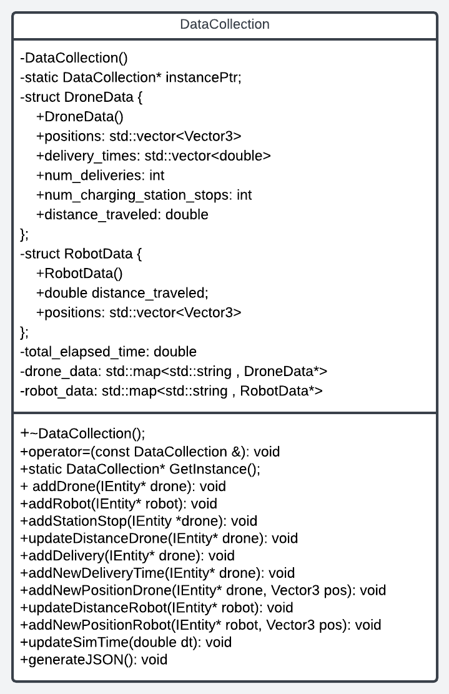

# Team-010-31

## Team Members

- [Drew Brock - brock450] <https://github.umn.edu/brock450>
- [Samuel Moerbitz - moerb001] <https://github.umn.edu/moerb001>
- [Andrew Guerra - guerr242] <https://github.umn.edu/guerr242>
- [Evan Bagwell - bagwe012] <https://github.umn.edu/bagwe012>
  
## Project Overview

This project is the Drone Simulation System, or in short Uber++. It is about simulating a rideshare system with drones that pick up passengers who are represented as robots within the system. The user of the simulation can schedule trips that populate the map with robots. Each robot has a starting point and destination point with the drone bringing them to their destination point. This is the initial concept and throughout the development process of the simulation, the system has grown incrementally through several weekly iterations.

## How to Run

There are two ways to run this system depending on ease of access, local environment, and editability.

### Using the Docker Container

This is the easiest and quickest way to run the simulation. The docker container can be found at this link <https://hub.docker.com/repository/docker/brock450/uber_drone_sim/general>

The prequisite for this is a running install of docker! The steps to run it are as follows.

1. In your terminal, type the command as follows. This will pull the container onto your machine.

```bash
docker pull brock450/uber_drone_sim
```

2. Then in your terminal, type the command as follows. This will build the simulation.

```bash
docker build -t brock450/uber_drone_sim .
```

3. Finally, type in your terminal the following command. This will start running the simulation!

```bash
docker run --rm -it -p 8081:8081 brock450/uber_drone_sim
```

4. Navigate to <http://localhost:8081> to see the simulation
5. Navigate to <http://localhost:8081/schedule.html> to schedule trips

The ports should automatically be forwarded to your machine from Docker by following the commands correctly!

### Running the code locally

This option is guaranteed to work on a CSELabs machine, but can also work on local linux environments. There is no guaranteed past CSELabs and Ubuntu. The steps to use it are as follows.

1. Get the newest copy of the simulation code from GitHub using the following command.

```bash
git clone https://github.umn.edu/umn-csci-3081-S23/Team-010-31-homework4.git
```

2. This copy uses the main branch which in this state is a final version of the Simulation system. Type the following command. This will create the build folder if it is not already there.

```bash
make -j
```

3. Run the project with this final command.

```bash
./build/bin/transit_service 8081 apps/transit_service/web/
```

4. If SSHing onto a labs machine make sure that port forwarding is enabled!
5. Navigate to <http://localhost:8081> to see the simulation
6. Navigate to <http://localhost:8081/schedule.html> to schedule trips

## Simulation Specifications

This simulation has many moving parts, so this will be formatted in two parts. The first part is the literal moving parts which includes the drone, robot, and yes... even a horse ("I'm proud of it!"- Drew). The second part is the behind the scenes which includes the simulation model, controller, and factories.

### Moving Parts

In the system the main players are the drone and robot. The robots are spawned in as the user of the simulation schedules 'trips.' These trips include a starting point, a destination, and a strategy. At the start of the simulation there is one drone created. The drone moves to the nearest robot to start a trip. This is where the strategies are used; there are four strategies: Astar, Dijkstras, DFS, and Beeline. The drone will always use the Beeline strategy to pick up a robot and then use the strategy dictated by the user when the trip was scheduled. There are also decorators on top of the drone and robots that determine a celebration. The drone and robot after a trip is completed will spin and/or jump depending on the strategy. Finally there are additional assets within the simulation which include a human, helicopter, and horse. They add some flavor to the simulation, but are not a core component.

### Behind the Scenes

The simulation model class manages the scheduling and creation of entities. It sets the graph for entities, schedules trips, and updates the simulation. This is the primary player, but it also utilizes the controller. The controller has methods used by the TransitService and WebServer which actually allows for the objects to show up. Finally, the factories are the actual system for creating entities used by the simulation model. They use the composite design pattern and each object has its own factory. Each factory has a create entity method which then populates within the simulation model.

### Entire System UML

<p align="center"> </p>

## Battery Decorator

### UML of feature

<p align="center"> </p>

The battery decorator implements the concept of each drone not lasting forever. They will run out of battery over the course of the simulation and have to recharge. This is significantly interesting as it can be applied to the logistical problem of recharge stations for electric vehicles in the real world.
It adds to the existing work by wrapping batteries around the drones as well as adding charging stations in four locations around the map. We utilized the decorator design pattern to implement this. The reasoning for this is that in a hypothetical, not all drones may be electric and would be some other variation. This abides by SOLID principles and specifically the O in being open to extensions. This extension connects to the next one as it displays the active battery data and amount of charging cycles to the user AND saves it to a json file at the user's discretion.

## Data Collection and Analysis

### UML of feature

<p align="center"> </p>

The Data Collection extension has a couple components involved. There is an added GUI to the simulation that tracks passengers delivered and battery charge. Behind the scenes it is also tracking data points. The data points are number of deliveries, number of stops at charging stations, a vector of positions, and a vector of delivery times. This is significantly interesting as it represents some sort of useful data in improving efficiency. For example, if a drone in a certain area has to recharge more often and has less deliveries then put a new charging station. There was quite a bit of effort put in to formatting the data, creating the web elements, and connecting the existing system. This used the singleton and observer patterns. The singleton is the one object responsible for taking in and outputting the data. The observer looks at this and displays it in the GUI. It is not a notification system necessarily, but it updates to the user live. This is fairly different from the default singleton, as a much larger portion of this extension was displaying the active status of the drones to the user rather than rigorously analyzing the data. The data is stored in JSON format and there are examples in the tests directory. There is some light discussion of patterns found in the file DataDiscussion.md, but in sum it was pretty much just the normal distribution.

## Sprint Retrospective

### What worked well?

We have a group with a diverse skillset which is really nice for general quality of product. With the moving parts there was general equal assignment and things (even a bit late) got done. The group also had some group coding sessions which proved to be the most productive. These allowed for things that would have come up at a stand up meeting to get worked on live.

### What could be improved?

We definitely should have had more communication, but more specifically, more stand up meetings. The output of code was good, but it can be tough for others when there isn't a meeting to know what the progress and blockers were for that code.

### What did you learn?

You gotta trust your group! Things get done; there may be issues, bugs, or a nasty segfault, but things get done. Agile requires trust and it makes sense with a group of people who are good at what they do.

## Docker Link

See section above titled, "Using the Docker Container"

<https://hub.docker.com/repository/docker/brock450/uber_drone_sim/general>

## Youtube Presentation Link

https://youtu.be/LhoHu2iOCaQ
